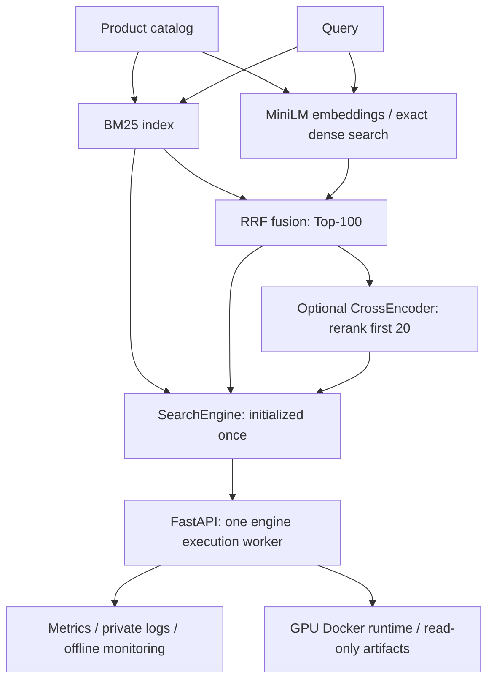

# Production Product Search — Retrieval, Ranking & Serving

End-to-end product search combining BM25, dense retrieval, hybrid fusion and
CrossEncoder reranking with frozen evaluation, FastAPI serving, benchmarking,
observability and locally validated GPU Docker deployment.

**Measured evidence:**
- Frozen final test: Hybrid **NDCG@10 0.7219**, **Recall@100 0.3905**;
  Hybrid + CE-20 **NDCG@10 0.7431** (paired-bootstrap interval includes zero).
- Local HTTP C=1 P95: **~3 ms BM25 / ~14 ms Hybrid / ~19 ms Hybrid + CE**.
- Deployment: **36/36 native/container ranking comparisons matched**, including scores.

[Final evaluation](reports/phase9/REPORT.md) · [Serving measurements](reports/phase6/REPORT.md) ·
[Docker evidence](reports/phase8/REPORT.md) · [Release provenance](reports/release_summary.json)

## Overview

Ranking quality alone is not enough for a production ML search system. This project
connects retrieval and ranking quality to latency, throughput, queueing, reliability,
observability, artifact reproducibility and deployment reproducibility. It is a
production-style local system on WANDS, with measured operating limits and retained
evidence; it has not been deployed as an enterprise-scale service.

## Architecture



Three HTTP pipeline modes:

| Mode | Behavior |
|---|---|
| `bm25` | Low-cost lexical baseline; Top-K up to 100. |
| `hybrid` | BM25 + MiniLM dense retrieval, equal-weight RRF; Top-K up to 100. |
| `hybrid_rerank` | Hybrid Top-100 → CrossEncoder reranks the first 20; Top-K up to 20. |

Frozen models: `sentence-transformers/all-MiniLM-L6-v2` and
`cross-encoder/ms-marco-MiniLM-L6-v2`, both using product names for model input.
Hybrid uses RRF k=60 and 100 candidates per component; dense search is exact cosine,
not ANN. The serving default remains Hybrid. Dense-only is an offline baseline,
not a fourth HTTP mode. [Retrieval identity](artifacts/phase2/manifest.json) ·
[Reranker identity](artifacts/phase3/manifest.json) · [Runtime contracts](docs/runtime.md).

## Final quality

**Frozen held-out final test: 96 queries; 95 evaluable for relevance metrics.**

| Pipeline | Recall@20 | Recall@100 | NDCG@10 | NDCG@20 |
|---|---:|---:|---:|---:|
| BM25 | 0.1060 | 0.3488 | 0.6518 | 0.6338 |
| Dense | 0.1212 | 0.3635 | 0.6833 | 0.6793 |
| Hybrid | 0.1311 | 0.3905 | 0.7219 | 0.7204 |
| Hybrid + CE-20 | 0.1311 | N/A | 0.7431 | 0.7319 |

CE returns only 20 scored results, with no untouched tail; Recall@100 is therefore
N/A. Recall counts Partial/Exact judgments as positive; NDCG uses graded gain
2^grade − 1. One query has no positive judgments and undefined relevance metrics.

**CE-20 increased final NDCG@10 from 0.7219 to 0.7431**, with mean paired delta
**+0.0211**, 95% paired-bootstrap CI **[-0.0034, +0.0465]** (10,000 resamples).
The observed held-out improvement was positive, but the interval included zero.
CE remains a quality-prioritized optional mode; no statistically confirmed universal
gain or post-test pipeline promotion is claimed.

BM25 and dense retrieval surfaced materially different relevant candidates.
Hybrid increased final Recall@100 from **0.3488 to 0.3905** relative to BM25,
supporting lexical/semantic complementarity on this dataset.
See [exact final results, paired analysis and complementarity](reports/phase9/REPORT.md).

## Serving measurements

Authoritative HTTP results use two independent service runs, 24 train queries,
K=10, C=1/2/4/8 and 960 requests per case/run. Every measured response was checked
against direct-core rankings. Quality above and performance below use separate data.

| Pipeline | C=1 P95 (ms) | C=8 P95 (ms) | Observed requests/s region |
|---|---:|---:|---:|
| BM25 | 2.99–3.21 | 27.38–31.51 | 363.35–526.02 |
| Hybrid | 13.70–14.66 | 91.15–95.15 | 77.26–93.68 |
| Hybrid + CE | 19.22–19.31 | 130.19–135.49 | 54.95–63.21 |

P95 ranges span the two runs at the stated concurrency. Throughput ranges span
all four concurrency levels across both runs; they are not C=8-only values or
capacity guarantees. **Local controlled RTX 4070 benchmark; not a production SLA.**

Under the single-engine execution worker, increasing HTTP concurrency primarily
increased waiting and tail latency while Hybrid/CE throughput improved modestly.
The benchmark separates engine execution from adapter time; the latter includes
queueing and other HTTP work, not pure queue wait. Later observability validation
measured queue visibility directly. BM25 also reflects substantial client/HTTP overhead.
See [benchmark evidence](reports/phase6/REPORT.md) and [methodology](docs/benchmarking.md).

## Reliability

Frozen version/checksum validation rejects missing or corrupt required artifacts
before readiness. One SearchEngine loads models and indexes at startup, avoiding
per-request initialization. CE inference failure explicitly falls back to Hybrid,
with requested/effective pipelines, fallback reason and degraded readiness visible.
Dense failure is explicit. Request IDs and structured logs support diagnosis.

The GPU deployment runs as non-root with a read-only filesystem and read-only
artifact mounts. It rejects unavailable GPU rather than silently substituting a CPU
runtime. Native/container parity checks protect the ranking contract.
[HTTP lifecycle and failure semantics](docs/http_service.md).

## Observability and monitoring

`/health`, `/ready`, `/version` and `/metrics` expose liveness, readiness, frozen
identity and bounded-cardinality Prometheus metrics. Instrumentation tracks latency,
queue wait, fallback, pipeline usage, result count and query-length distributions.
**Raw query text is not logged by default.**

ML monitoring uses a deterministic train-only baseline, synthetic drift scenarios,
query length/category/embedding statistics, CE-score distributions and offline
champion/challenger replay. Drift signals are diagnostics, not proof of ranking
quality degradation. **No real production traffic is available. No online A/B test
has been performed.** [Observability](docs/observability.md) ·
[ML monitoring](docs/ml_monitoring.md).

## Deployment

The real Docker image was validated on RTX 4070: two independent READY starts,
36/36 exact native/container ordering and score comparisons, endpoint checks,
startup rejection for missing artifacts/bad checksums/unavailable GPU, and graceful
shutdown. Models, indexes and inference catalog are provisioned separately and
mounted read-only; relevance labels are absent from the image and runtime bundle.

The Linux Python/CUDA dependencies and base image are hash-pinned. Bit-identical
full Docker rebuilds and a completed full no-cache build are not claimed; clean
application-wheel rebuilds were verified. [Deployment procedure](docs/deployment.md) ·
[Verified container evidence](reports/phase8/REPORT.md).

## Evaluation discipline and reproducibility

Development → validation selection → frozen retrieval/reranker/runtime/deployment
→ pre-access final-test freeze → one primary final evaluation → one exact rerun.

Final-test relevance labels stayed sealed through Phase 8. The freeze record was
written before first authorized access. No post-test tuning occurred; the sole
rerun matched all six deterministic result files and raw rankings/scores exactly.
The test set is now spent and is not a development or quick-start input.

The [release-candidate manifest](reports/phase9/release_candidate_manifest.json)
links source, model, artifact and evidence identities. Evaluation used system commit
`75c72d0` plus the pre-access hash-frozen evaluation harness, subsequently committed
without changing its bytes. Later documentation commits do not redefine that evaluated
system identity. [Current release summary](reports/release_summary.json) records the
separate documentation baseline and pending final documentation commit.

## Quick start

Use PowerShell from the repository root. The validated native environment uses
Windows Python 3.14 and an RTX 4070 CUDA runtime. These are **serving workflows for
already provisioned frozen artifacts**, not a self-contained fresh-clone demo.
Git intentionally excludes raw/processed data, model weights, indexes and embeddings.
For data provenance and licensing see [data documentation](data/README.md).
For artifact requirements and pinned Linux dependencies see [deployment](docs/deployment.md).
Do not run final evaluation or rebuild/select models as part of setup.

### Local

With the validated environment and `configs/runtime.json` artifact closure present:

```powershell
.\.venv\Scripts\python.exe scripts/serve.py --port 8000
Invoke-RestMethod http://127.0.0.1:8000/ready
Invoke-RestMethod -Method Post -Uri http://127.0.0.1:8000/search `
  -ContentType 'application/json' `
  -Body '{"query":"wooden office desk","pipeline":"hybrid","top_k":10}'
```

### Docker GPU

Requires Linux amd64 Docker/Compose with NVIDIA GPU exposure and the separately
provisioned, verified inference-only bundle at `reports/tmp/phase8-bundle`.
The [bundle packaging procedure](docs/deployment.md#build-the-inference-bundle)
can package existing frozen artifacts; it does not download or rebuild models.

```powershell
$env:SEARCH_BUNDLE = (Resolve-Path reports/tmp/phase8-bundle).Path
docker compose config --quiet
docker compose build
docker compose up -d
Invoke-RestMethod http://127.0.0.1:8000/ready
docker compose stop
```

These commands reproduce the validated workflow; they were not rerun for this
documentation update. Historical phase documents retain their original status
statements; [release preparation notes](docs/release_preparation.md) explain their scope.

## Repository layout

```text
src/product_search/   core retrieval, ranking, API, observability
configs/              frozen runtime/evaluation configuration
scripts/              build, validation, benchmark, deployment tooling
tests/                unit/regression tests
docs/                 methodology and deployment documentation
reports/              measured evidence
artifacts/            small provenance manifests
```

## Evidence

- [Final held-out evaluation](reports/phase9/REPORT.md)
- [Serving benchmark](reports/phase6/REPORT.md) and [methodology](docs/benchmarking.md)
- [Observability](docs/observability.md) and [ML monitoring](docs/ml_monitoring.md)
- [Docker deployment](docs/deployment.md) and [deployment validation](reports/phase8/REPORT.md)
- [Release-candidate manifest](reports/phase9/release_candidate_manifest.json)
- [Release preparation and metadata](docs/release_preparation.md)
- [Resume bullets](docs/resume_bullets.md) and [interview topics](docs/interview_talking_points.md)

## Limitations

- WANDS is an offline benchmark; unjudged query-product pairs are not confirmed negatives.
- No real production traffic or online A/B test; drift scenarios are synthetic.
- The final CE paired-bootstrap interval includes zero.
- A single engine worker limits concurrency scaling; no hard inference cancellation or admission cap.
- Measurements use one local RTX 4070 environment; no cross-hardware guarantee.
- No cloud autoscaling/orchestration or public production deployment.

## Future work

Evidence motivates evaluating parallel execution and batching for queueing, ANN at
larger catalog scale, and real traffic feedback/online experimentation before
learned ranking or calibration. Cloud orchestration would require separate capacity
and reliability validation. None of these extensions is implemented here.
